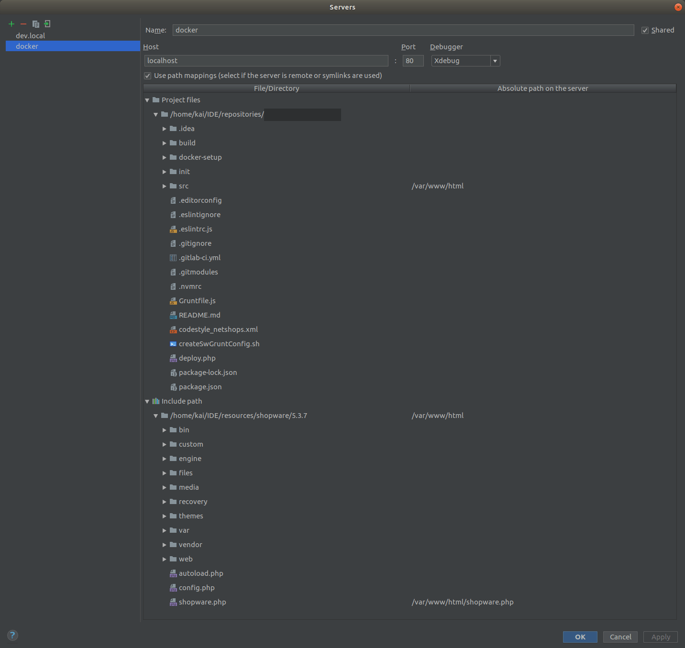

# Docker setup by Etribes

This docker setup was intended to be used with Shopware but as it is that generic you could run almost every PHP based web application that needs a webserver and database.

Feel free to contribute.

>Important information: This setup is for local programing purposes only! It should not be used in a production environment.

## Installation instructions

### Getting started

1. Set a host entry in your local hosts file to ``127.0.0.1 dev.local``
2. Navigate to your projects root
3. Execute ``git clone https://github.com/eTribes-Connect-GmbH/docker-setup.git``
4. Navigate to the created folder with ``cd docker-setup/``
5. Adjust the shopware release url in ``docker-compose.yml``
6. Execute ``docker-compose pull`` to get the newest images
7. Change ``FULL_WIPE_ON_REBOOT`` in ``docker-compose.yml`` to ``"false"`` if you dont need the installation wizard.
8. Change the environment variable ``COMPOSE_PROJECT_NAME=project`` in ``.env``
9. Execute ``docker-compose up``
10. If needed run your setup and change ``FULL_WIPE_ON_REBOOT`` in ``docker-compose.yml`` to ``"true"`` afterwards. Alternatively you can just import an SQL dump.
11. Open [http://dev.local/](http://dev.local/) in your browser.

#### Additional setup instruction for OS X users

Because of a bug in Docker for Mac you have to setup SFTP deployment in your PhpStorm.
1. Open your Project PhpStorm.
2. Navigate to *Tools > Deployment > Configuration...*
3. Add a new SFTP server and name it "Docker SFTP". Default credentials: 
    ```
    Host: dev.local
    User: root
    Password: password
    Port: 2200
    ```
4. In the tab "Mapping", click on the most upper button to set the server as default server.
5. Navigate to *Tools > Deployment > Options...*
6. Change *Upload changed files automatically to the default server* to "Always".

### Database credentials

```
Host: db
User: root
Password: root
Database: dev
```
    
### Configuring Mailhog

1. Navigate to the Shopware backend
2. Open the Global Settings and search for "Mailer"
3. Apply the following settings:
    - Method: smtp
    - Hostname for message id: mailhog.dev.local
    - Mail hostname: mailfetcher
    - Port: 1025
    - Prefix:
    - SMTP user: test
    - SMTP password: test
    - Connection auth: login
4. Open the [mailhog webinterface](http://dev.local:8025/)
5. Send a mail from the [Shopware backend](http://dev.local/backend/) (Settings -> Email Templates -> Choose a template -> Send test email to shop owner)

### Configuring XDebug

1. Open PhpStorm
2. Click on "Run" and the sub element "Edit Configurations..."
3. Add a new configuration with the type "PHP Remote Debug"
    1. Give it the name "docker"
    2. Check the checkbox "Filter debug connection by IDE key"
    3. Set the "IDE key (session id)" to "PHPSTORM"
    4. Configure a server by clicking on the "..." behind the select box.
        1. Apply the following settings:
        
    5. Click the OK button
4. Click the OK button
5. Now read the following tutorial and you should be ready to use XDebug: [Using the PhpStorm Debugger](https://confluence.jetbrains.com/display/PhpStorm/Using+the+PhpStorm+Debugger#UsingthePhpStormDebugger-Hello,Debugger)


## Docker structure

### Image layers

* **datacontainer**
    * Image: netshops/dev_data_container_shopware:latest
    * Description: This container holds a fresh installation of Shopware and extracts it on every "up".
* **datasync**
    * Image: netshops/dev_data_sync:latest
    * Description: This container syncs ``/var/www/src`` into ``/var/www/html`` on "up" and after that constatly with ``inotify`` on file changes.
* **webserver**
    * Image: netshops/dev_webserver
    * Description: Webserver to serve contents. Just configure it to your needs.
* **db**
    * Image: percona:latest (MySQL Fork)
    * Description: A MySQL container. Choose whatever you like (e.g. MySQL, MariaDB, Percona)
* **mailfetcher**
    * Image: mailhog/mailhog:latest
    * Description: A mail fetcher. Can be opened under [http://dev.local:8025/](http://dev.local/)
* **sftp**
    * Image: netshops/docker_dev_sftp
    * Description: A sFTP container.
    
### Directory structure

* projectname/
    * docker-setup/
        * services/ _(config files mounted as volumes)_
            * percona
            * webserver
        * src/
            * config_dev.php _(copy to ../../src/)_
    * src/ _(changed files that are synced into a fresh shop-installation)_
        * custom/plugins/.../
        * engine/Shopware/Plugins/.../
        * themes/Frontend/YourThemeName/
        
## Licence

This project uses the [GNU General Public License v3.0](LICENCE.md).
